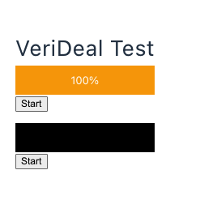

# Verideal Test

Simple app to start and view progress of the process run in backend.

## Installation

### Frontend
```bash
cd frontend
npm install
npm run dev
```

### Backend
```bash
cd backend
pip install -r requirements.txt
./manage.py migrate
./manage.py runserver 0:8012
```


## Usage

Open `http://localhost:5173/`

Click "Start"

## Demo

